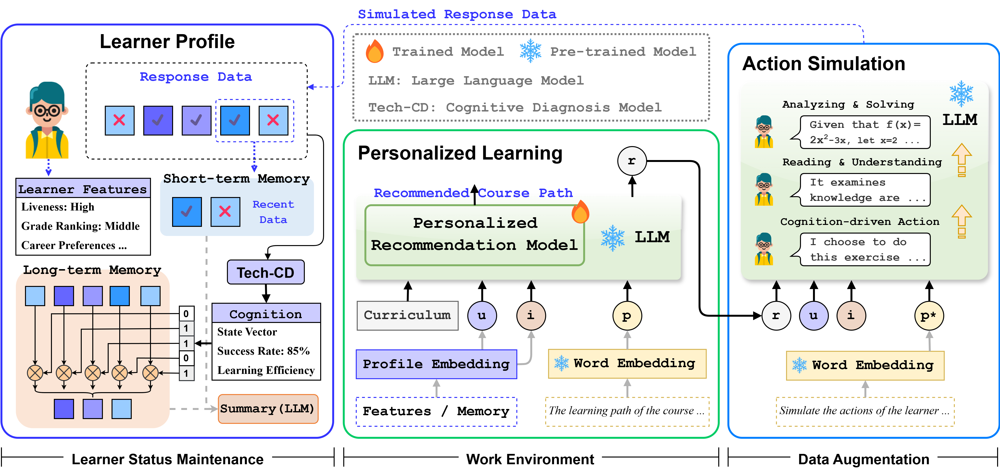

# zero-shot
The official implementation version of "Learning Like a Human: Zero-Shot Personalized Course Path Optimization via Cognitive Diagnosis and LLM Agents"



# 1. Installation
1. Download the source code with git

2. Create conda environment:
      ```
      conda create -y -n main python=3.9
      conda activate Zero-shot
      ```
3. Install pytorch 1.13.0
      ```
      pip install torch==1.13.0+cu117 torchvision==0.14.0+cu117 torchaudio==0.13.0 --extra-index-url https://download.pytorch.org/whl/cu117
      ```
4. Install [Minkowski Engine v0.5.4](https://github.com/NVIDIA/MinkowskiEngine?tab=readme-ov-file#pip)

5. Install pytorch_lightning 1.9.0 with torchmetrics 1.4.0.post0
    ```
    pip install --no-cache-dir pytorch_lightning==1.9.0
    ```
   
7. Install the additional dependencies:
   ```
   pip install -e .
   ```

   ```
   cd Tech-NeuralCD
   pip install -r requirements.txt
   ```
      
# 2. Data

Please download the following data into a folder e.g. `/data` and unzip:

- **100K Coursera's Course Reviews Dataset** from https://www.kaggle.com/datasets/septa97/100k-courseras-course-reviews-dataset.

- **MOOCCube Dataset** and **MOOCCourse Dataset** from http://moocdata.cn/data/MOOCCube.


## Quick start

### Key Components
```bash
cd Code
├── action.py           # The AgentAction class (this file)
├── llm_client.py       # Wrapper for LLM calls (e.g., OpenAI API)
├── config.py           # Configuration file (API key, simulation parameters)
└── profile.py          # learner profile
```
AgentAction Module: Simulates learner decisions, problem-solving, and reflections.
Memory Module: Tracks short-term and long-term knowledge mastery, supports reinforcement and forgetting effects.
Profile Module: Maintains a cognitive diagnosis-based learner profile.
LLM Client: Calls large language models for reasoning and generating task outputs.

First, install LLM using `pip` or Homebrew or `pipx` or `uv`:

```bash
pip install llm
```

Or with Homebrew (see [warning note](https://llm.datasette.io/en/stable/setup.html#homebrew-warning)):

```bash
brew install llm
```

Or with [pipx](https://pypa.github.io/pipx/):

```bash
pipx install llm
```

Or with [uv](https://docs.astral.sh/uv/guides/tools/)

```bash
uv tool install llm
```

If you have an [OpenAI API key](https://platform.openai.com/api-keys) key you can run this:

```bash
# Paste your OpenAI API key into this
llm keys set openai

# Run a prompt (with the default gpt-4o-mini model)
llm "Please recommend a course learning path for me to learn Python!"

Run prompts against [Gemini](https://aistudio.google.com/apikey) or [Anthropic](https://console.anthropic.com/) with their respective plugins:

```bash
llm install llm-gemini
llm keys set gemini
# Paste Gemini API key here
llm -m gemini-2.0-flash 'Please simulate the user's learning actions!'

llm install llm-anthropic
llm keys set anthropic
# Paste Anthropic API key here
llm -m claude-4-opus 'Please simulate the user's learning actions!'
```

```bash
# Install the plugin
llm install llm-ollama

# Download and run a prompt against the Orca Mini 7B model
ollama pull llama3.2:latest
llm -m llama3.2:latest 'Extract a summary from user history responses.'
```

To start [an interactive chat](https://llm.datasette.io/en/stable/usage.html#usage-chat) with a model, use `llm chat`:

```bash
llm chat -m gpt-4.1
```

```default
Chatting with gpt-4.1
Type 'exit' or 'quit' to exit
Type '!multi' to enter multiple lines, then '!end' to finish
Type '!edit' to open your default editor and modify the prompt.
Type '!fragment <my_fragment> [<another_fragment> ...]' to insert one or more fragments
> Tell me a joke about a pelican
Why don't pelicans like to tip waiters?

Because they always have a big bill!
```

# 3. Train:
```
cd Tech-NeuralCD
python train.py
```

# 4. Test:
```
cd Code/main.py
```
## Algorithms

The table below lists the recommendation algorithms currently available in the repository.

| Algorithm | Type | Description | Example |
|-----------|------|-------------|---------|
| Extreme Deep Factorization Machine (xDeepFM)<sup>*</sup> | Collaborative Filtering | Deep learning based algorithm for implicit and explicit feedback with user/item features. It works in the CPU/GPU environment. | [Quick start](examples/00_quick_start/xdeepfm_criteo.ipynb) |
| Embedding Dot Bias | Collaborative Filtering | General purpose algorithm with embeddings and biases for users and items. It works in the CPU/GPU environment. | [Quick start](examples/00_quick_start/embdotbias_movielens.ipynb) |
| LightFM/Factorization Machine | Collaborative Filtering | Factorization Machine algorithm for both implicit and explicit feedbacks. It works in the CPU environment. | [Quick start](examples/02_model_collaborative_filtering/lightfm_deep_dive.ipynb) |
| LightGBM/Gradient Boosting Tree<sup>*</sup> | Content-Based Filtering | Gradient Boosting Tree algorithm for fast training and low memory usage in content-based problems. It works in the CPU/GPU/PySpark environments. | [Quick start in CPU](examples/00_quick_start/lightgbm_tinycriteo.ipynb) / [Deep dive in PySpark](examples/02_model_content_based_filtering/mmlspark_lightgbm_criteo.ipynb) |
| LightGCN | Collaborative Filtering | Deep learning algorithm which simplifies the design of GCN for predicting implicit feedback. It works in the CPU/GPU environment. | [Deep dive](examples/02_model_collaborative_filtering/lightgcn_deep_dive.ipynb) |
| GRU | Collaborative Filtering | Sequential-based algorithm that aims to capture both long and short-term user preferences using recurrent neural networks. It works in the CPU/GPU environment. | [Quick start](examples/00_quick_start/sequential_recsys_amazondataset.ipynb) |
| Multinomial VAE | Collaborative Filtering | Generative model for predicting user/item interactions. It works in the CPU/GPU environment. | [Deep dive](examples/02_model_collaborative_filtering/multi_vae_deep_dive.ipynb) |
| Neural Recommendation with Long- and Short-term User Representations (LSTUR)<sup>*</sup> | Content-Based Filtering | Neural recommendation algorithm for recommending news articles with long- and short-term user interest modeling. It works in the CPU/GPU environment. | [Quick start](examples/00_quick_start/lstur_MIND.ipynb) |
| Neural Recommendation with Attentive Multi-View Learning (NAML)<sup>*</sup> | Content-Based Filtering | Neural recommendation algorithm for recommending news articles with attentive multi-view learning. It works in the CPU/GPU environment. | [Quick start](examples/00_quick_start/naml_MIND.ipynb) |
| Neural Collaborative Filtering (NCF) | Collaborative Filtering | Deep learning algorithm with enhanced performance for user/item implicit feedback. It works in the CPU/GPU environment.| [Quick start](examples/00_quick_start/ncf_movielens.ipynb) / [Deep dive](examples/02_model_collaborative_filtering/ncf_deep_dive.ipynb) |
| Neural Recommendation with Personalized Attention (NPA)<sup>*</sup> | Content-Based Filtering | Neural recommendation algorithm for recommending news articles with personalized attention network. It works in the CPU/GPU environment. | [Quick start](examples/00_quick_start/npa_MIND.ipynb) |
| Neural Recommendation with Multi-Head Self-Attention (NRMS)<sup>*</sup> | Content-Based Filtering | Neural recommendation algorithm for recommending news articles with multi-head self-attention. It works in the CPU/GPU environment. | [Quick start](examples/00_quick_start/nrms_MIND.ipynb) |
| Next Item Recommendation (NextItNet) | Collaborative Filtering | Algorithm based on dilated convolutions and residual network that aims to capture sequential patterns. It considers both user/item interactions and features.  It works in the CPU/GPU environment. | [Quick start](examples/00_quick_start/sequential_recsys_amazondataset.ipynb) |
| Restricted Boltzmann Machines (RBM) | Collaborative Filtering | Neural network based algorithm for learning the underlying probability distribution for explicit or implicit user/item feedback. It works in the CPU/GPU environment. | [Quick start](examples/00_quick_start/rbm_movielens.ipynb) / [Deep dive](examples/02_model_collaborative_filtering/rbm_deep_dive.ipynb) |
| Riemannian Low-rank Matrix Completion (RLRMC)<sup>*</sup> | Collaborative Filtering | Matrix factorization algorithm using Riemannian conjugate gradients optimization with small memory consumption to predict user/item interactions. It works in the CPU environment. | [Quick start](examples/00_quick_start/rlrmc_movielens.ipynb) |
| Simple Algorithm for Recommendation (SAR)<sup>*</sup> | Collaborative Filtering | Similarity-based algorithm for implicit user/item feedback.  It works in the CPU environment. | [Quick start](examples/00_quick_start/sar_movielens.ipynb) / [Deep dive](examples/02_model_collaborative_filtering/sar_deep_dive.ipynb) |
| Self-Attentive Sequential Recommendation (SASRec) | Collaborative Filtering | Transformer based algorithm for sequential recommendation. It works in the CPU/GPU environment. | [Quick start](examples/00_quick_start/sasrec_amazon.ipynb) |
| Short-term and Long-term Preference Integrated Recommender (SLi-Rec)<sup>*</sup> | Collaborative Filtering | Sequential-based algorithm that aims to capture both long and short-term user preferences using attention mechanism, a time-aware controller and a content-aware controller. It works in the CPU/GPU environment. | [Quick start](examples/00_quick_start/sequential_recsys_amazondataset.ipynb) |
| Multi-Interest-Aware Sequential User Modeling (SUM)<sup>*</sup> | Collaborative Filtering | An enhanced memory network-based sequential user model which aims to capture users' multiple interests. It works in the CPU/GPU environment. | [Quick start](examples/00_quick_start/sequential_recsys_amazondataset.ipynb) |
| Sequential Recommendation Via Personalized Transformer (SSEPT) | Collaborative Filtering | Transformer based algorithm for sequential recommendation with User embedding. It works in the CPU/GPU environment. | [Quick start](examples/00_quick_start/sasrec_amazon.ipynb) |
| Standard VAE | Collaborative Filtering | Generative Model for predicting user/item interactions.  It works in the CPU/GPU environment. | [Deep dive](examples/02_model_collaborative_filtering/standard_vae_deep_dive.ipynb) |
| Surprise/Singular Value Decomposition (SVD) | Collaborative Filtering | Matrix factorization algorithm for predicting explicit rating feedback in small datasets. It works in the CPU/GPU environment. | [Deep dive](examples/02_model_collaborative_filtering/surprise_svd_deep_dive.ipynb) |
| Term Frequency - Inverse Document Frequency (TF-IDF) | Content-Based Filtering | Simple similarity-based algorithm for content-based recommendations with text datasets. It works in the CPU environment. | [Quick  start](examples/00_quick_start/tfidf_covid.ipynb) |
| Vowpal Wabbit (VW)<sup>*</sup> | Content-Based Filtering | Fast online learning algorithms, great for scenarios where user features / context are constantly changing. It uses the CPU for online learning. | [Deep dive](examples/02_model_content_based_filtering/vowpal_wabbit_deep_dive.ipynb) |
| Wide and Deep | Collaborative Filtering | Deep learning algorithm that can memorize feature interactions and generalize user features. It works in the CPU/GPU environment. | [Quick start](examples/00_quick_start/wide_deep_movielens.ipynb) |
| xLearn/Factorization Machine (FM) & Field-Aware FM (FFM) | Collaborative Filtering | Quick and memory efficient algorithm to predict labels with user/item features. It works in the CPU/GPU environment. | [Deep dive](examples/02_model_collaborative_filtering/fm_deep_dive.ipynb) |
