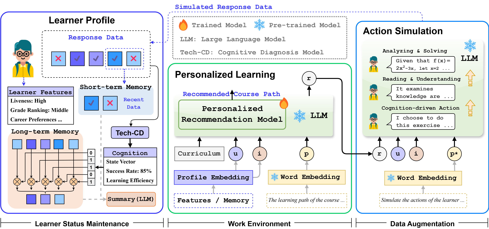

# zero-shot
The official implementation version of "Learning Like a Human: Zero-Shot Personalized Course Path Optimization via Cognitive Diagnosis and LLM Agents"



# 1. Installation
1. Download the source code with git

2. Create conda environment:
      ```
      conda create -y -n main python=3.9
      conda activate Zero-shot
      ```
3. Install pytorch 1.13.0
      ```
      pip install torch==1.13.0+cu117 torchvision==0.14.0+cu117 torchaudio==0.13.0 --extra-index-url https://download.pytorch.org/whl/cu117
      ```
4. Install [Minkowski Engine v0.5.4](https://github.com/NVIDIA/MinkowskiEngine?tab=readme-ov-file#pip)

5. Install pytorch_lightning 1.9.0 with torchmetrics 1.4.0.post0
    ```
    pip install --no-cache-dir pytorch_lightning==1.9.0
    ```
   
7. Install the additional dependencies:
   ```
   pip install -e .
   ```

   ```
   cd Tech-NeuralCD
   pip install -r requirements.txt
   ```
      
# 2. Data

Please download the following data into a folder e.g. `/data` and unzip:

- **100K Coursera's Course Reviews Dataset** from https://www.kaggle.com/datasets/septa97/100k-courseras-course-reviews-dataset.

- **MOOCCube Dataset** and **MOOCCourse Dataset** from http://moocdata.cn/data/MOOCCube.


## Quick start

First, install LLM using `pip` or Homebrew or `pipx` or `uv`:

```bash
pip install llm
```

Or with Homebrew (see [warning note](https://llm.datasette.io/en/stable/setup.html#homebrew-warning)):

```bash
brew install llm
```

Or with [pipx](https://pypa.github.io/pipx/):

```bash
pipx install llm
```

Or with [uv](https://docs.astral.sh/uv/guides/tools/)

```bash
uv tool install llm
```

If you have an [OpenAI API key](https://platform.openai.com/api-keys) key you can run this:

```bash
# Paste your OpenAI API key into this
llm keys set openai

# Run a prompt (with the default gpt-4o-mini model)
llm "Please recommend a course learning path for me to learn Python!"

Run prompts against [Gemini](https://aistudio.google.com/apikey) or [Anthropic](https://console.anthropic.com/) with their respective plugins:

```bash
llm install llm-gemini
llm keys set gemini
# Paste Gemini API key here
llm -m gemini-2.0-flash 'Please simulate the user's learning actions!'

llm install llm-anthropic
llm keys set anthropic
# Paste Anthropic API key here
llm -m claude-4-opus 'Please simulate the user's learning actions!'
```

```bash
# Install the plugin
llm install llm-ollama

# Download and run a prompt against the Orca Mini 7B model
ollama pull llama3.2:latest
llm -m llama3.2:latest 'Extract a summary from user history responses.'
```

To start [an interactive chat](https://llm.datasette.io/en/stable/usage.html#usage-chat) with a model, use `llm chat`:

```bash
llm chat -m gpt-4.1
```

```default
Chatting with gpt-4.1
Type 'exit' or 'quit' to exit
Type '!multi' to enter multiple lines, then '!end' to finish
Type '!edit' to open your default editor and modify the prompt.
Type '!fragment <my_fragment> [<another_fragment> ...]' to insert one or more fragments
> Tell me a joke about a pelican
Why don't pelicans like to tip waiters?

Because they always have a big bill!
```

# 3. Train:
```
cd Tech-NeuralCD
python train.py
```

# 4. Test:
```
cd test/test_chat.py
```
